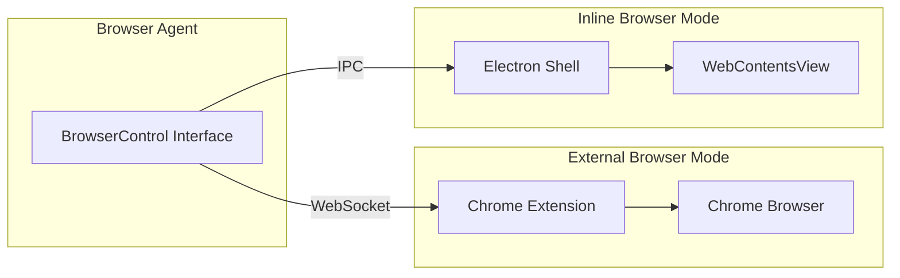
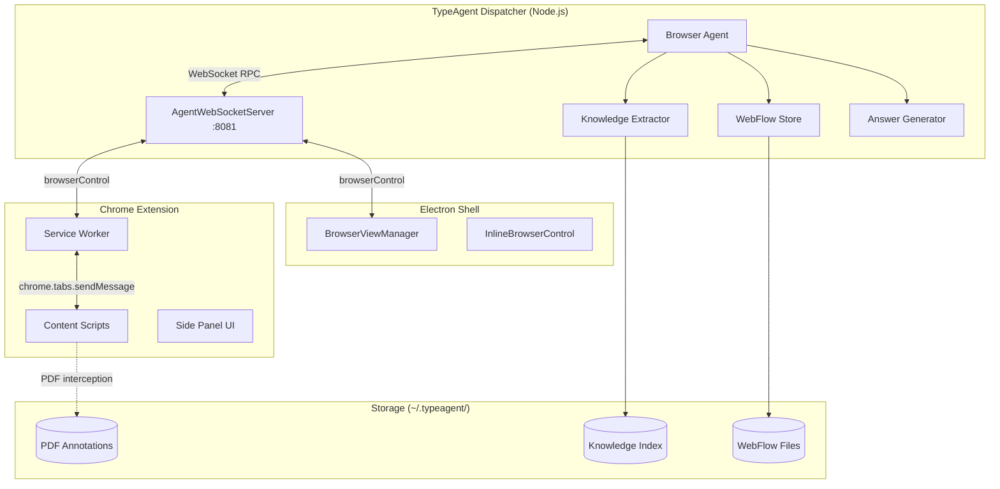
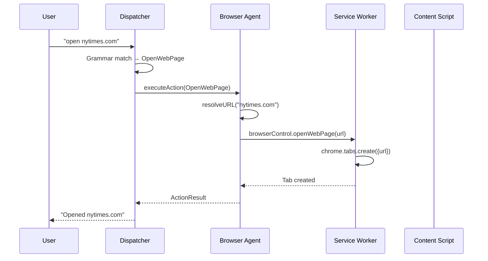

# Browser Agent — Architecture & Design

> **Scope:** This document is the architecture reference for the TypeAgent
> browser agent — the component map, process model, multi-tier RPC
> architecture, and action lifecycle. For end-to-end scenario walkthroughs
> (browser control, knowledge discovery, WebFlows, action discovery), see
> `browserScenarios.md`. For the RPC messaging protocol, channel
> multiplexing, and connection lifecycle, see `browserRpc.md`.

## Overview

The browser agent enables TypeAgent to control a web browser, extract
knowledge from web pages, record and replay browser automation workflows,
and dynamically discover actions on unfamiliar sites. It is the most
architecturally complex agent in the system, spanning four OS processes
and three communication transports.

### Dual-Mode Architecture

The browser agent operates in two distinct modes:

| Mode | Backend | Use case |
| ---- | ------- | -------- |
| **External Browser Mode** | Chrome/Edge extension communicating via WebSocket | Standalone browser use, works with user's existing browser |
| **Inline Browser Mode** | Electron BrowserView embedded in TypeAgent Shell | Integrated experience with direct IPC control |

Both modes implement the same `BrowserControl` interface, making the agent
code backend-agnostic. The agent automatically selects the active backend
based on availability (Electron preferred when the shell is running,
extension as fallback).



```
"open nytimes.com and scroll down"
        ↓  grammar match
{ actionName: "OpenWebPage", parameters: { site: "nytimes.com" } }
        ↓  dispatcher
Browser agent handler
        ↓  WebSocket RPC
Chrome extension service worker
        ↓  chrome.tabs API
New tab opens at nytimes.com
```

### Key concepts

| Term | Meaning |
| ---- | ------- |
| **Browser agent** | The Node.js `AppAgent` implementation that handles browser-related actions. Runs inside the dispatcher process. |
| **Extension** | A Chrome MV3 extension with a service worker, content scripts, and side panel UI. Connects to the agent via WebSocket. |
| **Electron host** | The TypeAgent shell's main process, which can embed browser tabs as `WebContentsView` instances and control them directly. |
| **BrowserControl** | The shared TypeScript interface (`browserControl.mts`) that both the extension and Electron host implement. All browser automation flows through this interface. |
| **WebFlow** | A recorded, parameterized browser automation script that can be replayed with different inputs. |
| **WebAgent** | A site-specific agent (crossword, Instacart, commerce) that runs inside the browser page and registers with the dispatcher at runtime. |

---

## Design Principles

These principles guide the browser agent's architecture:

### 1. Process isolation

The browser agent runs in three separate processes (agent, extension
service worker, content scripts) to prevent a crash in one from affecting
the others, to isolate permissions (only the content script has DOM
access), and to allow the agent to serve multiple browser instances.

> **Why this matters:** A runaway content script (e.g., stuck in a loop
> on a malicious page) cannot crash the dispatcher or affect other tabs.
> The service worker can detect unresponsive content scripts and
> re-inject them.

### 2. Dual-mode flexibility

The same agent code runs in both External Browser Mode (Chrome +
extension) and Inline Browser Mode (Electron WebContentsView) to support
different user workflows without code duplication. Both backends
implement the `BrowserControl` interface.

> **Design trade-off — why not only Electron?** Electron provides tighter
> integration and faster IPC, but many users prefer their existing Chrome
> profile with bookmarks, passwords, and extensions. The extension mode
> lets TypeAgent control the user's real browser.

### 3. Stateless agent process

The agent process does not maintain browser state (tabs, URLs, DOM)
locally. All browser state lives in the browser/Electron process and is
queried on demand via RPC. This simplifies recovery after agent restarts.

> **Why this matters:** If the agent crashes, the browser keeps running.
> When the agent restarts, it reconnects and resumes control without
> losing the user's tabs or navigation history.

### 4. Extension as thin adapter

The Chrome extension service worker is a pass-through layer that
translates between WebSocket RPC (to the agent) and Chrome APIs (to
content scripts). It contains no business logic — all intelligence is in
the agent process.

> **Design trade-off — why not put more logic in the extension?** MV3
> service workers have a 30-second idle timeout and limited debugging.
> Moving logic to Node.js provides better observability, debuggability,
> and the ability to use standard Node.js packages (like the AI SDKs).

### 5. Layered knowledge pipeline

Knowledge extraction flows through multiple layers (content capture →
transport → AI extraction → indexing → search), each with clear
boundaries. This allows independent testing and substitution of
components (e.g., different AI models, different storage backends).

---

## Design Trade-offs

This section documents key architectural decisions and the alternatives
that were considered.

### WebSocket vs. Native Messaging

> **Design trade-off — why WebSocket instead of native messaging?**
> Chrome extensions can use native messaging to communicate with a native
> host process. We chose WebSocket RPC instead because:
>
> 1. **Electron compatibility** — Native messaging is Chrome-specific;
>    WebSocket works for both Chrome extension and Electron shell.
> 2. **Debugging** — WebSocket traffic is visible in browser DevTools;
>    native messaging requires external tooling.
> 3. **Cross-machine** — WebSocket allows the agent to run on a different
>    machine (useful for remote debugging and multi-user scenarios).
>
> The cost is managing WebSocket lifecycle (reconnection, heartbeats)
> instead of relying on Chrome's native messaging guarantees.

### BrowserReasoningAgent vs. Traditional Actions

> **Design trade-off — why BrowserReasoningAgent vs. traditional actions?**
> Traditional actions use the grammar/LLM pipeline to translate user
> requests into typed actions executed by the agent. BrowserReasoningAgent
> uses an agentic loop (Claude SDK) to autonomously plan and execute
> multi-step browser workflows.
>
> We chose to support both because:
>
> 1. **Predictability** — Traditional actions are fast and deterministic
>    for known patterns (search, extract, navigate).
> 2. **Flexibility** — Agentic mode handles novel, multi-step tasks that
>    cannot be pre-enumerated in the action schema.
> 3. **Cost control** — Traditional actions use cached translations;
>    agentic mode makes multiple LLM calls per task.
>
> The dispatcher routes to BrowserReasoningAgent only when the user
> explicitly requests agentic mode or when the task matches specific
> complexity heuristics.

### Tiered Storage Model

> **Design trade-off — why five storage tiers?**
> Browser agent state spans ephemeral in-memory maps to permanent file
> storage. This complexity exists because:
>
> 1. **MV3 constraints** — Service workers cannot hold persistent state;
>    chrome.storage.session survives idle restarts but not browser restart.
> 2. **Performance** — Hot paths (extraction dedup, RPC routing) need
>    in-memory lookup; cold paths (knowledge index, WebFlow scripts)
>    can tolerate disk I/O.
> 3. **Cross-device sync** — Settings should sync via Chrome account;
>    knowledge data should not (too large, user-specific).
>
> The cost is debugging complexity — stale caches in one tier can cause
> confusing behavior in another.

---

## Component map

The browser agent consists of five major components, each running in a
different execution context.



**Detailed component layout:**

```
┌─────────────────────────────────────────────────────────────────────┐
│                      TypeAgent Dispatcher                           │
│                      (Node.js process)                              │
│  ┌───────────────────────────────────────────────────────────────┐  │
│  │  Browser Agent (browserActionHandler.mts)                     │  │
│  │  ├─ Action router: executeBrowserAction()                     │  │
│  │  ├─ AgentWebSocketServer (port 8081)                          │  │
│  │  ├─ ExternalBrowserClient (RPC proxy to extension)            │  │
│  │  ├─ Knowledge subsystem (extraction, indexing, search)        │  │
│  │  ├─ WebFlow store (recording, generation, execution)          │  │
│  │  └─ Discovery subsystem (page analysis, dynamic agents)       │  │
│  └───────────────────────────────────────────────────────────────┘  │
└──────────────────────────────┬──────────────────────────────────────┘
                               │ WebSocket (port 8081)
                               │ Channel-multiplexed RPC
                ┌──────────────┴──────────────┐
                │                             │
┌───────────────▼───────────────┐  ┌──────────▼──────────────────────┐
│  Chrome Extension             │  │  Electron Shell                  │
│  (service worker process)     │  │  (main process)                  │
│  ┌─────────────────────────┐  │  │  ┌──────────────────────────┐   │
│  │ WebSocket client        │  │  │  │ BrowserViewManager       │   │
│  │ ExternalBrowserServer   │  │  │  │ BrowserAgentIpc          │   │
│  │ RPC handler pool (100+) │  │  │  │ InlineBrowserControl     │   │
│  │ Tab/recording manager   │  │  │  │ CDP fingerprint masking  │   │
│  └────────────┬────────────┘  │  │  └──────────┬───────────────┘   │
│               │               │  │             │                    │
│  ┌────────────▼────────────┐  │  │  ┌──────────▼───────────────┐   │
│  │ Content Scripts         │  │  │  │ WebContentsView tabs     │   │
│  │ (per-tab, per-frame)    │  │  │  │ (per-tab renderer)       │   │
│  │ ├─ DOM interaction      │  │  │  │ ├─ Content scripts       │   │
│  │ ├─ Recording capture    │  │  │  │ ├─ WebAgent instances    │   │
│  │ ├─ Schema extraction    │  │  │  │ └─ Site agent activation │   │
│  │ ├─ Auto-indexing        │  │  │  └──────────────────────────┘   │
│  │ └─ WebAgent runtime     │  │  └─────────────────────────────────┘
│  └─────────────────────────┘  │
│                               │
│  Side Panel UI                │
│  ├─ Chat interface            │
│  ├─ Knowledge library         │
│  ├─ Macros library            │
│  └─ Graph visualizations      │
└───────────────────────────────┘
```

### Process model

| Process | Technology | Role |
| ------- | ---------- | ---- |
| **Dispatcher** | Node.js | Runs the browser agent handler, WebSocket server, knowledge index, and WebFlow store. All LLM calls originate here. |
| **Extension service worker** | Chrome MV3 service worker (ES module) | Maintains WebSocket connection to agent, implements browser control RPC, manages tabs and recording state via Chrome APIs. Wakes on events, no persistent state in memory. |
| **Content script** | Chrome content script (isolated world) + MAIN world scripts | Runs per-tab. Handles DOM interaction, event capture, recording, auto-indexing, SPA navigation detection, PDF interception, and WebAgent runtime. |
| **Electron main** | Electron main process | Manages `WebContentsView` instances as browser tabs, provides direct browser control via `executeJavaScript()` and IPC-based content script RPC, handles CDP fingerprint masking. |

The extension and Electron host are **alternative browser control backends**.
The agent selects the active client based on availability and preference
(Electron preferred when available, extension as fallback). Both implement
the same `BrowserControl` interface, so the agent handler code is
backend-agnostic.

---

## Agent manifest and sub-schemas

The browser agent registers with the dispatcher via `manifest.json`:

| Schema name | Type | Default | Purpose |
| ----------- | ---- | ------- | ------- |
| `browser` | primary | enabled | Core browser actions (open, close, navigate, scroll, zoom, screenshot, search) |
| `browser.lookupAndAnswer` | injected | enabled | Web search and Q&A using page content |
| `browser.external` | transient | disabled | External browser window control |
| `browser.actionDiscovery` | transient | disabled | Page action detection and dynamic agent registration |
| `browser.webFlows` | regular | enabled | WebFlow management (list, delete, edit, generate, execute) |

Each sub-schema has its own action types, grammar rules, and handler. The
dispatcher routes actions to the correct handler based on the schema name
prefix.

The manifest also registers a `website` indexing service
(`browserIndexingService`) that provides knowledge extraction and search
capabilities for visited web pages.

---

## Action lifecycle

This section traces a browser action from user input to DOM effect.



### 1. Grammar matching

User input is matched against `browserSchema.agr`, which defines patterns
for all core browser actions:

```agr
<OpenWebPage> =
    open $(site:WebPageMoniker)
  | go to $(site:WebPageMoniker)
  | navigate to $(site:WebPageMoniker)
  | browse to $(site:WebPageMoniker)
  | visit $(site:WebPageMoniker);
```

On match, the grammar produces a typed action:

```typescript
{ actionName: "OpenWebPage", parameters: { site: "nytimes.com" } }
```

### 2. Dispatcher routing

The dispatcher validates the action against `BrowserActions` (the union
type in `browserActionSchema.mts`) and calls `executeBrowserAction()` on
the browser agent handler.

### 3. Schema-based handler dispatch

`executeBrowserAction()` routes to the appropriate handler based on the
action's schema:

```
schemaName === "browser"              → core browser handler
schemaName === "browser.external"     → external browser handler
schemaName === "browser.lookupAndAnswer" → lookup/answer handler
schemaName === "browser.actionDiscovery" → discovery handler
schemaName === "browser.webFlows"     → WebFlow handler
```

### 4. Browser control invocation

For a core action like `OpenWebPage`, the handler:

1. Resolves the site name to a URL using the resolver chain (search →
   keyword → Wikipedia → history)
2. Calls `browserControl.openWebPage(url)` on the active `BrowserControl`
   implementation

### 5. RPC transport (extension path)

When the extension is the active client:

```
ExternalBrowserClient.openWebPage(url)
    ↓ browserControlRpc.invoke("openWebPage", url)
    ↓ WebSocket message (browserControl channel)
    ↓
Extension service worker: ExternalBrowserServer handler
    ↓ chrome.tabs.create({ url }) or chrome.tabs.update(tabId, { url })
    ↓
Browser navigates to URL
```

### 6. RPC transport (Electron path)

When Electron is the active client:

```
InlineBrowserControl.openWebPage(url)
    ↓ shellWindow.createBrowserTab(url)
    ↓
BrowserViewManager.createBrowserTab()
    ↓ new WebContentsView()
    ↓ webContents.loadURL(url)
    ↓
Embedded browser tab navigates to URL
```

### 7. Content script interaction

For actions that require DOM access (click, enter text, scroll), the
control path extends into the content script:

```
browserControl.clickOn(selector)
    ↓ contentScriptRpc.clickOn(selector)
    ↓ chrome.tabs.sendMessage(tabId, rpcMessage, { frameId: 0 })
    ↓
Content script: RPC handler executes click on DOM element
    ↓ document.querySelector(selector).click()
    ↓
RPC response flows back through the chain
```

---

## BrowserControl interface

Both the extension and Electron host implement `BrowserControl`
(`browserControl.mts`). This is the contract that makes the agent
backend-agnostic.

### BrowserControlInvokeFunctions (awaited calls)

**Navigation & page control:**
- `openWebPage(url, options?)` — Navigate to URL, optionally in new tab
- `closeWebPage()` / `closeAllWebPages()` — Close tabs
- `goBack()` / `goForward()` / `reload()` — History navigation
- `switchTabs(description, index?)` — Switch by description or index
- `search(query?, sites?, provider?, options?)` — Execute search

**Content access:**
- `getPageTextContent()` — Extract visible text (innerText)
- `getHtmlFragments(useTimestampIds?, compressionMode?)` — DOM snapshot
- `captureScreenshot()` — Base64 PNG via CDP
- `readPageContent()` / `stopReadPageContent()` — Text-to-speech

**Element interaction:**
- `clickOn(cssSelector)` — Click element
- `setDropdown(cssSelector, optionLabel)` — Set select value
- `enterTextIn(textValue, cssSelector?, submitForm?)` — Type text
- `followLinkByText(keywords, openInNewTab?)` — Click link by text match
- `followLinkByPosition(position, openInNewTab?)` — Click nth link

**Page lifecycle:**
- `awaitPageLoad(timeout?)` — Wait for navigation to complete
- `awaitPageInteraction(timeout?)` — Wait for user action

**View control:**
- `scrollUp()` / `scrollDown()` — Scroll page
- `zoomIn()` / `zoomOut()` / `zoomReset()` — Zoom control

**Settings:**
- `getBrowserSettings()` — Returns `{ autoIndexing, extractionMode }`
- `getAutoIndexSetting()` — Returns boolean

**Extensibility:**
- `runBrowserAction(actionName, parameters, schemaName?)` — Execute named action

### BrowserControlCallFunctions (fire-and-forget)

- `setAgentStatus(isBusy, message)` — Update extension badge/status

---

## Agent context and state

The browser agent maintains a `BrowserActionContext` that tracks all
runtime state:

```typescript
interface BrowserActionContext {
    // Browser control backends
    clientBrowserControl?: BrowserControl;       // Electron direct control
    externalBrowserControl?: ExternalBrowserClient; // Extension RPC proxy
    browserControl?: BrowserControl;             // Active control (selected)

    // Client management
    useExternalBrowserControl: boolean;
    preferredClientType: "extension" | "electron";
    agentWebSocketServer?: AgentWebSocketServer;

    // Knowledge subsystem
    index?: any;                    // Website memory index
    websiteCollection?: any;        // Indexed website collection

    // WebFlow subsystem
    webFlowStore?: WebFlowStore;

    // URL resolution
    resolverSettings: {
        searchResolver: boolean;
        keywordResolver: boolean;
        wikipediaResolver: boolean;
        historyResolver: boolean;
    };

    // Search
    searchProviders: SearchProvider[];   // Bing, Google, Yahoo, DuckDuckGo
    activeSearchProvider: SearchProvider;

    // Utilities
    localHostPort: number;
    tabTitleIndex?: any;            // For tab switching by description
    viewProcess?: ChildProcess;     // Spawned browser process
    browserProcess?: ChildProcess;
    fuzzyMatchingModel?: any;       // For entity resolution
}
```

### Context lifecycle

1. **`initializeBrowserContext()`** — Creates empty context with default
   settings (search providers, resolver preferences, local host port)

2. **`updateBrowserContext(enable, context, schemaName)`** — Called when a
   schema is enabled/disabled. On first enable:
   - Initializes `WebFlowStore` (lazy, shared promise to prevent concurrent init)
   - Loads website index from disk
   - Creates `AgentWebSocketServer` on port 8081
   - Sets up channel-multiplexed RPC
   - Creates `ExternalBrowserClient` wrapper
   - Registers client lifecycle callbacks
   - Hydrates cached settings from disk

3. **`executeBrowserAction(action, context)`** — Routes to schema-specific
   handler (see [Action lifecycle](#action-lifecycle))

---

## Client management

The `AgentWebSocketServer` manages connections from both extension and
Electron clients simultaneously.

### Client selection

```typescript
interface BrowserClient {
    id: string;
    type: "extension" | "electron";
    socket: WebSocket;
    connectedAt: Date;
    lastActivity: Date;
    channelProvider?: ChannelProviderAdapter;
    agentRpc?: RpcProxy<BrowserAgentInvokeFunctions>;
    browserControlRpc?: RpcProxy<BrowserControlInvokeFunctions>;
}
```

The server selects the **active client** based on priority:
1. Electron client (preferred when the shell is running)
2. Extension client (standalone browser use)
3. Any connected client (fallback)

When a new client connects, the server re-evaluates and may switch the
active client. Duplicate connections from the same client ID cause the
older connection to close with reason `"duplicate"`.

### Connection protocol

1. Client connects to `ws://localhost:8081/?channel=browser&role=client&clientId=<id>`
2. Server sends `welcome` message with connection status
3. Both sides set up channel-multiplexed RPC via `ChannelProviderAdapter`:
   - `browserControl` channel: Agent → Browser (automation commands)
   - `agentService` channel: Browser → Agent (knowledge, import, WebFlow operations)
4. Keep-alive pings every 20 seconds
5. Auto-reconnection with 5-second intervals on disconnect

---

## State Management

The browser agent's state is distributed across five storage tiers, from
ephemeral in-memory maps to permanent file system storage. Understanding
where state lives is critical for debugging — a stale cache in one tier
can cause confusing behavior in another.

```
┌─────────────────────────────────────────────────────────────────┐
│  Tier 1: In-Memory (ephemeral, lost on process restart)         │
│  ├─ Agent process: extraction cache, retry counters, RPC maps   │
│  ├─ Service worker: RPC map, navigation dedup, callbacks        │
│  ├─ Content script: recording state, DOM element IDs            │
│  └─ Electron: BrowserViewManager tab map                        │
├─────────────────────────────────────────────────────────────────┤
│  Tier 2: Chrome Storage Session (survives SW restart, not       │
│          browser restart)                                       │
│  └─ Recording state: actions, HTML, screenshots, index          │
├─────────────────────────────────────────────────────────────────┤
│  Tier 3: Chrome Storage Sync/Local (permanent, synced across    │
│          devices for sync)                                      │
│  └─ Settings: websocketHost, autoIndexing, extractionMode       │
│  └─ Search history                                              │
├─────────────────────────────────────────────────────────────────┤
│  Tier 4: File System — User Data (~/.typeagent/)                │
│  ├─ Knowledge index: entity/topic graphs, website collection    │
│  ├─ WebFlow store: flow definitions, scripts, registry index    │
│  ├─ Shell settings: window state, user preferences              │
│  └─ PDF storage: annotations, URL mappings                      │
├─────────────────────────────────────────────────────────────────┤
│  Tier 5: File System — Instance Storage (agent context)         │
│  └─ Per-agent session data managed via agent SDK                │
└─────────────────────────────────────────────────────────────────┘
```

### Key in-memory state (Tier 1)

| Process | State | Purpose | Lifetime |
| ------- | ----- | ------- | -------- |
| **Agent** | `extractionCache` | Prevents duplicate parallel extractions | 10-min stale cleanup |
| **Agent** | `WebSocket clients` | Connected extension/Electron clients | Until client disconnects |
| **Agent** | `WebFlowStore` (loaded) | In-memory index + flow cache | Session, written to disk on save |
| **Service worker** | Content script RPC map | Per-tab RPC connections | Until tab closes |
| **Service worker** | Analytics cache | Dashboard data | 5-min TTL |
| **Content script** | Recording state | Active recording data | Tab lifetime, synced to session storage |
| **Electron** | Browser tabs map | Active `WebContentsView` instances | Until tab closed |

### State recovery on restart

| Component restart | What's lost | What's recovered | Recovery mechanism |
| ----------------- | ----------- | ---------------- | ------------------ |
| **Agent process** | All in-memory caches, WebSocket clients | Knowledge index, WebFlow store, settings | Loaded from disk on `updateBrowserContext()` |
| **Service worker** | RPC map, navigation dedup, callbacks | Recording state, settings | chrome.storage.session, chrome.storage.sync |
| **Content script** | DOM element IDs, module variables | Recording state (if active) | `restoreRecordingStateFromStorage()` |
| **Electron shell** | Tab map, message queue | Window geometry, active tab | `shellSettings.json` on startup |
| **Browser restart** | All chrome.storage.session data | chrome.storage.sync/local, all disk data | Extension re-initializes, agent reconnects |

---

## Command interface

The browser agent exposes CLI commands via `@browser`:

```
@browser
├── auto
│   └── launch
│       ├── standalone    # Spawn visible browser via child_process
│       └── hidden        # Spawn headless browser
│   └── close             # Kill spawned browser
├── open <site>           # Navigate to URL
├── close                 # Close current tab
├── external
│   ├── on                # Enable extension-based control
│   └── off               # Disable extension-based control
├── resolver
│   ├── list              # Show enabled URL resolvers
│   ├── keyword           # Toggle keyword resolver
│   └── history           # Toggle history resolver
├── extractKnowledge      # Trigger knowledge extraction on current page
├── ask <question>        # Query page knowledge
├── actions
│   ├── discover          # Detect page actions
│   ├── record <name>     # Start recording interaction
│   └── stop recording    # End recording and save
└── search
    └── [provider commands]
```

---

## Dynamic capabilities

The browser agent supports three forms of runtime extensibility:

### Dynamic grammar and schema (WebFlows)

The `WebFlowStore` generates grammar rules and TypeScript action schemas
at runtime from stored WebFlow definitions. When a user records a new
WebFlow, the store:

1. Generates grammar patterns from the flow's `grammarPatterns` field
2. Generates a TypeScript action schema from the flow's parameter definitions
3. Registers both with the dispatcher via `getDynamicGrammar()` and
   `getDynamicSchema()` callbacks

This allows natural language like "order coffee from Starbucks" to match
a user-recorded WebFlow without any static grammar changes.

### Dynamic agents (WebAgents)

Site-specific WebAgents register with the dispatcher at page load time:

1. Content script detects a supported site (crossword, Instacart, etc.)
2. WebAgent registers via Chrome port → service worker → WebSocket → dispatcher
3. Dispatcher adds the agent with its action schema and grammar
4. User can now issue site-specific commands ("fill in 3 across with HELLO")
5. On page unload, the WebAgent deregisters

### Goal-driven automation (BrowserReasoningAgent)

The `BrowserReasoningAgent` (`webFlows/reasoning/`) enables autonomous,
multi-step browser tasks using AI-driven reasoning. Unlike recorded
WebFlows that follow a fixed script, the reasoning agent can adapt to
page variations and make decisions in real-time.

**Architecture:**
```
User goal: "Find the cheapest flight from Seattle to NYC next week"
    ↓
BrowserReasoningAgent (Anthropic Claude SDK)
    ↓ Iterative reasoning loop
┌─────────────────────────────────────────────┐
│  1. Observe current page state (HTML/screenshot)
│  2. Reason about next action to achieve goal
│  3. Execute action via WebFlowBrowserAPI
│  4. Check if goal achieved or continue
└─────────────────────────────────────────────┘
    ↓
BrowserReasoningTrace (recorded steps for debugging/replay)
```

**Key components:**
| File | Purpose |
| ---- | ------- |
| `browserReasoningAgent.mts` | Main agent using `@anthropic-ai/claude-agent-sdk` |
| `browserReasoningTypes.mts` | `BrowserReasoningConfig`, `BrowserReasoningTrace`, `BrowserTraceStep` |
| `webFlowToolAdapter.mts` | Adapts `WebFlowBrowserAPI` as tools for the reasoning model |

**Configuration:**
```typescript
interface BrowserReasoningConfig {
    goal: string;              // Natural language goal
    maxSteps?: number;         // Limit iterations (default: 20)
    timeout?: number;          // Max execution time
    saveTrace?: boolean;       // Record steps for debugging
    screenshotOnStep?: boolean; // Capture state at each step
}
```

**Invocation:**
```
@browser actions goal "order a latte from the nearest Starbucks"
```
or via the `StartGoalDrivenTask` action in the `browser.webFlows` schema.

---

## Key source files

| File | Package | Role |
| ---- | ------- | ---- |
| `browserActionHandler.mts` | `agents/browser` | Main action handler, context management, action routing |
| `browserActionSchema.mts` | `agents/browser` | `BrowserActions` union type (20+ action types) |
| `browserSchema.agr` | `agents/browser` | Grammar rules for core browser actions |
| `manifest.json` | `agents/browser` | Agent manifest with sub-schemas |
| `browserControl.mts` | `agents/browser/common` | `BrowserControl` interface definition |
| `serviceTypes.mts` | `agents/browser/common` | RPC function type definitions (3 function groups) |
| `agentWebSocketServer.mts` | `agents/browser` | WebSocket server, client management |
| `externalBrowserControlClient.mts` | `agents/browser` | RPC proxy wrapping extension's BrowserControl |
| `externalBrowserControlServer.ts` | `agents/browser/extension` | Extension-side RPC server implementing BrowserControl |
| `serviceWorker/index.ts` | `agents/browser/extension` | Service worker entry, event listeners, initialization |
| `serviceWorker/websocket.ts` | `agents/browser/extension` | WebSocket connection, channel setup, keep-alive |
| `contentScript/index.ts` | `agents/browser/extension` | Content script entry, SPA detection, PDF interception |
| `browserViewManager.ts` | `shell` | Electron tab management, CDP setup |
| `browserIpc.ts` | `shell` | Electron WebSocket bridge to agent |
| `inlineBrowserControl.ts` | `shell` | Electron BrowserControl implementation |
| `webFlows/reasoning/browserReasoningAgent.mts` | `agents/browser` | AI reasoning agent for goal-driven tasks |
| `webFlows/webFlowBrowserApi.mts` | `agents/browser` | Browser API for WebFlow/reasoning execution |
| `search/answerGenerator.mts` | `agents/browser` | Enhanced answer generation with follow-ups |
| `knowledge/actions/analyticsActions.mts` | `agents/browser` | Knowledge extraction analytics |
| `views/server/server.mts` | `agents/browser` | Express server for PDF viewer and views |

---

## Subsystem pointers

The browser agent contains several subsystems. End-to-end scenario traces
for each are documented in `browserScenarios.md`:

| Subsystem | Source location | Scenario |
| --------- | --------------- | -------- |
| **Knowledge extraction** | `agent/knowledge/`, `agent/indexing/` | Scenario 2: Knowledge discovery |
| **Search & answer generation** | `agent/search/` | Scenario 7: Search & answer |
| **WebFlow recording/execution** | `agent/webFlows/`, `extension/contentScript/recording/` | Scenario 3: WebFlows |
| **Goal-driven automation** | `agent/webFlows/reasoning/` | Scenario 3: WebFlows (goal-driven) |
| **Action discovery** | `agent/discovery/` | Scenario 4: Action discovery |
| **WebAgent framework** | `extension/webagent/` | Scenario 5: WebAgents |
| **PDF viewing/annotation** | `views/server/features/pdf/`, `views/client/pdf/` | Scenario 6: PDF viewing |
| **Side panel UI** | `extension/views/` | (UI implementation) |

For feature-level documentation (not architecture), see `packages/agents/browser/docs/`.
