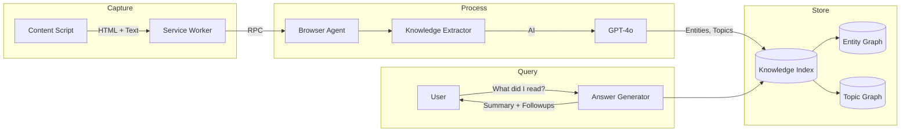

# Browser Scenarios & Capabilities

> **Scope:** This document traces user scenarios end-to-end through the
> browser agent architecture — browser control, knowledge extraction,
> WebFlow recording, action discovery, WebAgents, PDF viewing, and
> search/answer generation. Each scenario is presented as a numbered
> step-by-step trace with layer labels (Shell, Agent, Extension, Content
> Script) and function references. For the component architecture, see
> `browserAgent.md`. For the RPC protocol and invariants, see
> `browserRpc.md`.

## Overview

The browser agent supports six interconnected capability areas. Each
builds on the same multi-tier RPC infrastructure but serves a different
user need:

| Capability | User need | Key components |
| ---------- | --------- | -------------- |
| **Browser control** | "Open this page, click that link, scroll down" | Grammar, action handler, BrowserControl interface |
| **Knowledge discovery** | "What did I read about X?" | Extraction pipeline, website-memory index, hybrid search |
| **WebFlows** | "Record this checkout flow and replay it later" | Recording system, script generator, executor, dynamic grammar |
| **Action discovery** | "What can I do on this page?" | Page analysis, dynamic agent registration |
| **WebAgents** | "Fill in 3 across with HELLO" | In-page agent framework, site-specific handlers |
| **PDF viewing** | "Open this PDF and highlight key sections" | PDF.js viewer, annotation system, knowledge extraction |

### Action categories

| Category | Actions | Schema |
| -------- | ------- | ------ |
| **Core Browser** | `OpenWebPage`, `CloseWebPage`, `ScrollUp/Down`, `GoBack/Forward`, `ZoomIn/Out` | `browser` |
| **Search** | `ChangeSearchProvider`, `OpenSearchResult`, `SearchImageAction` | `browser` |
| **Content** | `CaptureScreenshot`, `ReadPageContent`, `GetWebsiteStats` | `browser` |
| **Lookup** | `LookupAndAnswerInternet` | `browser.lookupAndAnswer` |
| **External** | `OpenTab`, `CloseTab`, `SwitchToTab`, `AddToBookmarks` | `browser.external` |
| **Discovery** | `DetectPageActions`, `SummarizePage`, `RegisterPageDynamicAgent` | `browser.actionDiscovery` |
| **WebFlows** | `ListWebFlows`, `GenerateWebFlow`, `StartGoalDrivenTask` | `browser.webFlows` |
| **Crossword** | `EnterText`, `GetClueValue` | Dynamic (per-site) |
| **Commerce** | `SearchForProduct`, `AddToCart`, `FindNearbyStore` | Dynamic (per-site) |

---

## 1. Browser control

Browser control is the foundational capability: navigating pages,
interacting with elements, and reading content.

### Action schema

`BrowserActions` (`browserActionSchema.mts`) defines 20+ action types:

| Action | Parameters | Description |
| ------ | ---------- | ----------- |
| `OpenWebPage` | `site: string`, `tab?: "new"\|"current"\|"existing"` | Navigate to URL or resolve site name |
| `CloseWebPage` | — | Close current tab |
| `CloseAllWebPages` | — | Close all tabs |
| `ChangeTabs` | `tabDescription: string`, `tabIndex?: number` | Switch active tab |
| `GoBack` / `GoForward` | — | History navigation |
| `ScrollDown` / `ScrollUp` | — | Scroll page |
| `FollowLinkByText` | `keywords: string`, `openInNewTab?: boolean` | Click link matching text |
| `FollowLinkByPosition` | `position: number`, `openInNewTab?: boolean` | Click nth link |
| `ZoomIn` / `ZoomOut` / `ZoomReset` | — | Zoom control |
| `ReadPageContent` / `StopReadPageContent` | — | Text-to-speech |
| `CaptureScreenshot` | — | Capture page as PNG |
| `ReloadPage` | — | Refresh current page |
| `ChangeSearchProvider` | `name: string` | Switch search engine |
| `OpenSearchResult` | `position?`, `title?`, `url?`, `openInNewTab?` | Open previous search result |
| `SearchImageAction` | `searchTerm`, `numImages` | Web image search |
| `ExecuteAdHocScript` | `script`, `params?`, `timeout?` | Run inline WebFlow script |
| `GetWebsiteStats` | `groupBy?`, `limit?` | Index statistics |

### Grammar patterns

`browserSchema.agr` maps natural language to actions:

```agr
<OpenWebPage> =
    open $(site:WebPageMoniker)
  | go to $(site:WebPageMoniker) ;

<ScrollDown> = scroll down | page down ;

<FollowLinkByText> =
    follow (the) link $(keywords:wildcard)
  | click (on) (the) link $(keywords:wildcard)
  | click (on) $(keywords:wildcard) ;

<ChangeTabs> =
    switch to tab $(tabDescription:wildcard)
  | go to tab $(tabDescription:wildcard)
  | next tab ;
```

### URL resolution chain

When the user says "open nytimes", the agent resolves the site name to a
URL through a multi-stage resolver chain (in priority order):

1. **Direct URL** — If the input is already a URL, use it directly
2. **Search resolver** — Query the active search engine for a direct link
3. **Keyword resolver** — Match against a known site dictionary
4. **Wikipedia resolver** — Resolve to a Wikipedia article
5. **History resolver** — Match against browser history

Each resolver can be enabled/disabled via `@browser resolver` commands.

### End-to-end trace: "open nytimes.com and scroll down"

**Task:** User says "open nytimes.com and scroll down"

1. **Shell** (`PartialCompletionSession`): Receives user input, forwards
   to dispatcher.

2. **Dispatcher** (`actionDispatcher.mts`): Grammar matcher splits input
   into two actions:
   - `{ actionName: "OpenWebPage", parameters: { site: "nytimes.com" } }`
   - `{ actionName: "ScrollDown", parameters: {} }`

3. **Agent** (`browserActionHandler.mts`): `executeBrowserAction()` called
   for `OpenWebPage`:
   - `resolveWebPage("nytimes.com")` → tries resolver chain
   - Keyword resolver matches → `"https://www.nytimes.com"`

4. **Agent** (`externalBrowserControlClient.mts`):
   `browserControl.openWebPage(url)` → `browserControlRpc.invoke("openWebPage", url)`

5. **Extension** (`externalBrowserControlServer.ts`): RPC handler receives
   `openWebPage` → `chrome.tabs.create({ url: "https://www.nytimes.com" })`

6. **Chrome**: New tab opens, page begins loading.

7. **Agent**: First action completes, `executeBrowserAction()` called for
   `ScrollDown`:
   - `browserControl.scrollDown()` → `browserControlRpc.invoke("scrollDown")`

8. **Extension** (`externalBrowserControlServer.ts`): RPC handler receives
   `scrollDown` → `contentScriptRpc.scrollDown(tabId)`

9. **Extension** (`serviceWorker/index.ts`):
   `chrome.tabs.sendMessage(tabId, rpcMsg, { frameId: 0 })`

10. **Content Script** (`contentScript/elementInteraction.ts`): RPC
    handler → `window.scrollBy(0, window.innerHeight)`

11. **Agent**: Returns `ActionResult` with success message to shell.

#### What can go wrong

| Failure point | Symptom | Recovery |
| ------------- | ------- | -------- |
| Resolver chain fails | "Could not resolve site" error | Check resolver settings, try direct URL |
| WebSocket disconnected | Badge turns red, action hangs | Agent auto-reconnects in 5 seconds |
| Content script not loaded | Scroll action fails | Extension auto-injects on RPC failure |
| Tab not active | Scroll targets wrong tab | `switchTabs()` first |

### Content access methods

The agent can read page content in three ways, each with different
fidelity and cost:

| Method | What it returns | When to use |
| ------ | --------------- | ----------- |
| `getPageTextContent()` | `document.body.innerText` | Quick text extraction, search result parsing |
| `getHtmlFragments(useTimestampIds?, compressionMode?)` | DOM snapshot as fragment array | Knowledge extraction, page analysis, recording |
| `captureScreenshot()` | Base64 PNG via CDP | Visual verification, debugging |

The `compressionMode` parameter controls HTML fragment size:
- `"None"` — Full HTML
- `"knowledgeExtraction"` — Stripped to semantic content

---

## 2. Knowledge discovery

Knowledge discovery extracts structured information from visited web pages
and makes it searchable across browsing sessions.

### Architecture



**Component layout:**

```
┌──────────────────────┐     ┌──────────────────────┐
│  Content Script       │     │  Browser Agent        │
│  ├─ Auto-indexing     │────▶│  ├─ Knowledge handler │
│  ├─ HTML capture      │     │  ├─ website-memory    │
│  └─ Text extraction   │     │  ├─ AI model (GPT-4o) │
│                       │     │  └─ Knowledge index   │
└──────────────────────┘     └──────────────────────┘
```

### Extraction pipeline

1. **Content capture** — Content script extracts HTML fragments and/or
   text content from the current page
2. **Transport** — Service worker forwards captured content to the agent
   via the `agentService` WebSocket channel
3. **AI extraction** — Agent delegates to the `website-memory` library,
   which uses an AI model (GPT-4o or GPT-5 mini) to extract:
   - Named entities with confidence scores
   - Entity-to-entity relationships
   - Topic classification and hierarchy
   - Page summary
   - Suggested questions
4. **Indexing** — Extracted knowledge is stored in the local knowledge
   index with metadata (URL, title, domain, timestamp)
5. **Progress reporting** — Progress events flow back through the
   `knowledgeExtractionProgress` RPC callback to update the UI

### Extraction modes

| Mode | AI involvement | Output | Cost |
| ---- | -------------- | ------ | ---- |
| `basic` | None | Structured DOM extraction only | Free |
| `content` | AI content analysis | Entities, relationships, summary | Medium |
| `summary` | AI on pre-summarized content | Same as content, less input | Lower |
| `full` | Complete AI extraction | All of the above + suggested questions | Highest |

### Auto-indexing

The content script can automatically index pages as the user browses:

1. `autoIndexing.ts` monitors navigation events
2. On page load, checks eligibility (not a search results page, not
   already indexed, meets quality threshold)
3. Captures content and sends to agent for indexing
4. Indexing runs in background without blocking navigation

### Search capabilities

The knowledge index supports multiple search strategies:

| Strategy | Method | Use case |
| -------- | ------ | -------- |
| **Keyword** | `searchWebMemories(query)` | General text search across all indexed pages |
| **Entity** | `searchByEntities(entities[])` | Find pages mentioning specific entities |
| **Topic** | `searchByTopics(topics[])` | Find pages about specific topics |
| **Hybrid** | `hybridSearch(query)` | Combines keyword + entity + topic for best recall |

### Knowledge UI

The extension provides several views for browsing extracted knowledge:

- **Knowledge Library** (`knowledgeLibrary.html`) — Browse and search indexed pages
- **Entity Graph** (`entityGraphView.html`) — Visualize entity relationships
- **Topic Graph** (`topicGraphView.html`) — Visualize topic hierarchy
- **Annotations** (`annotationsLibrary.html`) — View page annotations

### End-to-end trace: "what did I read about climate change?"

**Task:** User asks "what did I read about climate change?"

1. **Shell**: Receives user input, routes to browser agent via dispatcher.

2. **Dispatcher** (`actionDispatcher.mts`): Grammar matches to
   `LookupAndAnswerInternet` or knowledge search action.

3. **Agent** (`browserActionHandler.mts`): Routes to
   `handleLookupAndAnswerAction()`.

4. **Agent** (`search/queryAnalyzer.mts`): `QueryAnalyzer.analyze(query)`
   → intent: `find_specific`, entities: `["climate change"]`, no temporal
   filter.

5. **Agent** (`searchWebMemories.mts`): `hybridSearch({ query })`:
   - Keyword search: finds pages containing "climate change"
   - Entity search: finds pages with "climate change" entity
   - Topic search: finds pages under climate/environment topics
   - Merges results, deduplicates

6. **Agent** (`search/utils/metadataRanker.mts`): `MetadataRanker.rank()`
   → sorts by relevance + recency, applies token budget (~64K chars).

7. **Agent** (`search/utils/contextBuilder.mts`): `ContextBuilder.build()`
   → extracts dominant domains, time range, top entities/topics.

8. **Agent** (`search/answerGenerator.mts`): Single LLM call via TypeChat
   → produces `AnswerEnhancement` with summary, key findings, follow-ups.

9. **Agent**: Returns `ActionResult` to shell:
   - Formatted answer with source citations
   - Related entities (clickable)
   - Follow-up suggestions as quick actions

#### What can go wrong

| Failure point | Symptom | Recovery |
| ------------- | ------- | -------- |
| Knowledge index empty | "No results found" | User hasn't indexed any pages yet |
| LLM timeout | Answer generation hangs | Retry, check API keys |
| Token budget exceeded | Incomplete answer | Reduce result count, filter domains |

---

## 3. WebFlows (macros)

WebFlows are the browser agent's system for recording user interactions,
generalizing them into parameterized scripts, and replaying them with
different inputs.

### Architecture

```mermaid
flowchart TB
    subgraph Record
        R1[Start Recording] --> R2[Capture Clicks/Inputs]
        R2 --> R3[Capture Screenshots]
        R3 --> R4[Stop Recording]
    end

    subgraph Process
        R4 --> N[Normalizer]
        N --> SG[Script Generator]
        SG --> |LLM| SCRIPT[WebFlow Script]
        SCRIPT --> V[Validator]
    end

    subgraph Store
        V --> GG[Grammar Generator]
        GG --> WFS[(WebFlow Store)]
        WFS --> DG[Dynamic Grammar]
    end

    subgraph Execute
        USER[User: "order latte"] --> DG
        DG --> |Match| SE[Script Executor]
        SE --> |Run| BC[BrowserControl]
    end
```

**Component layout:**

```
┌────────────────────────┐    ┌───────────────────────────┐
│  Content Script         │    │  Browser Agent             │
│  recording/             │    │  webFlows/                 │
│  ├─ actions.ts          │    │  ├─ recordingNormalizer    │
│  ├─ capture.ts          │    │  ├─ scriptGenerator        │
│  └─ index.ts            │    │  ├─ scriptValidator        │
│                         │    │  ├─ scriptExecutor         │
│  (captures DOM events)  │───▶│  ├─ grammarGenerator       │
│                         │    │  └─ webFlowStore            │
└────────────────────────┘    └───────────────────────────┘
```

### Recording system

The recording system captures user interactions in the content script:

**Recordable actions** (`recording/actions.ts`):
- `recordClick` — Element ID, coordinates, computed CSS selector, bounding box
- `recordInput` — Text value, target element selector
- `recordTextEntry` — Keystroke data
- `recordScroll` — Scroll position
- `recordNavigation` — URL changes, page unload

**Recorded action structure:**
```typescript
{
    id: number,
    type: "click" | "input" | "textInput" | "scroll" | "navigation",
    tag: string,
    cssSelector: string,
    boundingBox?: { x, y, width, height },
    timestamp: number,
    text?: string,
    value?: string,
    htmlIndex: number
}
```

**Capture data** (`recording/capture.ts`):
- Screenshots with annotated element boundaries
- HTML fragments with configurable compression
- DOM state snapshots

**State management** (`recording/index.ts`):
- `recording` flag, `recordedActions` array, `actionIndex` counter
- Periodic saves to Chrome storage for session resilience
- State restoration from storage on extension reload

### Normalization and script generation

When recording stops, the raw captured data flows through a pipeline:

1. **Normalization** (`recordingNormalizer.mts`) — Deduplicates actions,
   normalizes selectors, cleans up action sequences

2. **Script generation** (`scriptGenerator.mts`) — Converts normalized
   actions into a parameterized WebFlow script using LLM analysis of the
   recorded steps, HTML snapshots, and screenshots

3. **Validation** (`scriptValidator.mts`) — Validates generated script
   syntax and parameter bindings

### WebFlow definition

```typescript
{
    name: string,                    // e.g., "order-coffee"
    description: string,             // Human-readable description
    version: number,
    parameters: {
        [name: string]: {
            type: string,
            required: boolean,
            description: string,
            default?: any,
            valueOptions?: string[]
        }
    },
    script: string,                  // Async function body
    grammarPatterns: string[],       // NL patterns for matching
    scope: {
        type: "site" | "global",
        domains?: string[],
        urlPatterns?: string[]
    },
    source: "goal-driven" | "recording" | "discovered" | "manual"
}
```

### WebFlow Browser API

WebFlow scripts execute against a standardized browser API
(`webFlowBrowserApi.mts`):

**Navigation:** `navigateTo()`, `goBack()`, `awaitPageLoad()`, `awaitPageInteraction()`
**Interaction:** `click()`, `clickAndWait()`, `enterText()`, `clearAndType()`, `selectOption()`
**Content:** `getPageText()`, `captureScreenshot()`, `queryContent()`, `checkPageState()`
**Extraction:** `extractComponent<T>()` — Extract typed data from page using LLM

### Execution

The `scriptExecutor.mts` runs WebFlow scripts:

1. Validates script and parameters
2. Binds parameters to the script function
3. Creates a `WebFlowBrowserAPI` instance connected to the active browser
4. Executes the script with the API and parameters
5. For multi-page flows, stores continuation state in content script
   storage for cross-navigation persistence

### Dynamic grammar registration

When a WebFlow is stored, the `WebFlowStore` generates:
- Grammar rules from `grammarPatterns` (for NL matching)
- TypeScript action schemas from parameter definitions (for validation)

These register with the dispatcher via `getDynamicGrammar()` and
`getDynamicSchema()`, making the WebFlow available for natural language
invocation without static grammar changes.

### WebFlow actions

| Action | Description |
| ------ | ----------- |
| `ListWebFlows` | List saved flows (site/global/all) |
| `DeleteWebFlow` | Remove a flow |
| `EditWebFlowScope` | Change flow scope (site → global or vice versa) |
| `GenerateWebFlow` | Create flow from action trace |
| `GenerateWebFlowFromRecording` | Create flow from recorded user steps |
| `StartGoalDrivenTask` | Execute AI-driven workflow with reasoning agent |

### End-to-end example: recording a checkout flow

```
1. User starts recording:
   → @browser actions record "order-coffee"
   → Service worker sets recording flag
   → Content script begins capturing events

2. User interacts with the page:
   → Click "Order" button → recordClick({ cssSelector: "#order-btn", ... })
   → Type "latte" in search → recordInput({ value: "latte", cssSelector: "#search", ... })
   → Click "Add to cart" → recordClick({ cssSelector: ".add-cart", ... })
   → Navigate to checkout → recordNavigation({ url: "https://..." })

3. User stops recording:
   → @browser actions stop recording
   → Content script saves final state, sends to service worker
   → Service worker forwards recorded steps + HTML + screenshots to agent

4. Agent generates WebFlow:
   → recordingNormalizer cleans up action sequence
   → scriptGenerator (with LLM) produces parameterized script:
     async function(api, { drink }) {
       await api.click("#order-btn");
       await api.enterText("#search", drink);
       await api.clickAndWait(".add-cart");
     }
   → grammarGenerator produces: "order $(drink:wildcard) from coffee shop"
   → WebFlowStore saves and registers grammar/schema

5. User replays with different input:
   → "order espresso from coffee shop"
   → Grammar matches to WebFlow action with drink="espresso"
   → scriptExecutor runs the script with the new parameter
```

#### What can go wrong

| Failure point | Symptom | Recovery |
| ------------- | ------- | -------- |
| Service worker restart mid-recording | Actions partially lost | Recording persists to chrome.storage.session; auto-restores on restart |
| Script generation LLM fails | No WebFlow created | Retry generation, check API keys |
| Script validation fails | "Forbidden operation" error | Review generated script, regenerate with simpler recording |
| CSS selectors change | Replay fails to find element | Re-record flow on updated site |
| Multi-page flow navigation | Continuation lost | Flow stores state in content script storage |

---

## 4. Action discovery

Action discovery analyzes unfamiliar web pages to detect available
interactions and register them as actions.

### Architecture

```
┌──────────────────────┐     ┌──────────────────────────┐
│  Content Script       │     │  Browser Agent             │
│  ├─ HTML capture      │────▶│  discovery/                │
│  └─ Screenshot        │     │  ├─ translator.mts (LLM)   │
│                       │     │  ├─ actionHandler.mts       │
│                       │     │  └─ schema/ (action types)  │
└──────────────────────┘     └──────────────────────────┘
```

### Detection process

1. **Capture** — Content script captures HTML fragments and screenshots
   of the current page
2. **Page summary** — LLM generates a summary of the page's purpose and
   content (`SummarizePage` action)
3. **Action detection** — LLM analyzes the page structure to identify:
   - Forms and their fields
   - Buttons and their actions
   - Search interfaces
   - Navigation elements
   - Data tables and their columns
4. **Schema extraction** — Detected actions are converted into typed
   action schemas with parameter definitions
5. **Registration** — If the user confirms, a dynamic agent is registered
   with the dispatcher for the page's domain

### Discovery actions

| Action | Description |
| ------ | ----------- |
| `DetectPageActions` | Analyze page and detect available actions |
| `SummarizePage` | Generate page summary with LLM |
| `RegisterPageDynamicAgent` | Register site-specific agent from detected actions |
| `CreateWebFlowFromRecording` | Convert recording to reusable flow |
| `GetWebFlowsForDomain` / `GetAllWebFlows` | List available flows |
| `DeleteWebFlow` | Remove a flow |

### Dynamic agent lifecycle

```
1. User visits unfamiliar page
2. "discover actions on this page"
   → DetectPageActions
   → LLM analyzes HTML + screenshot
   → Returns: [SearchProducts, FilterByPrice, AddToCart, ...]

3. "register these actions"
   → RegisterPageDynamicAgent
   → Dispatcher adds dynamic agent for this domain
   → Grammar rules generated for detected actions

4. User can now say: "search for wireless headphones"
   → Grammar matches to the dynamically registered SearchProducts action
   → Action executes via BrowserControl.runBrowserAction()

5. User navigates away
   → Dynamic agent deregisters (if transient)
```

---

## 5. WebAgents

WebAgents are site-specific agents that run inside the browser page
itself, providing deep integration with specific web applications.

### Framework

The WebAgent framework (`extension/webagent/`) provides:

- **WebAgentContext** (`WebAgentContext.ts`) — Runtime context for in-page agents
- **WebAgent loader** (`webAgentLoader.ts`) — Dynamic loading into pages
- **WebAgent RPC** (`webAgentRpc.ts`) — Communication between page and dispatcher
- **Page components** (`common/pageComponents.ts`) — Typed component definitions (SearchInput, Button, Form, ProductTile, etc.)

### Registration flow

```
1. Content script detects supported site (via manifest URL patterns)
2. Site-specific script loads (e.g., sites/crossword.js)
3. Script creates WebAgent instance with:
   - Action schema (TypeScript types)
   - Grammar rules
   - Action handler
4. WebAgent connects via chrome.runtime.connect({ name: "typeagent" })
5. Service worker relays registration to agent via WebSocket
6. Agent forwards to dispatcher via addDynamicAgent()
7. Agent is now available for NL commands
```

### Built-in WebAgents

#### Paleobiology Database agent

**Supported sites:** paleobiodb.org

**Purpose:** Specialized schema extractor for the Paleobiology Database,
enabling structured queries against paleontological data.

**Location:** `extension/sites/paleobiodb.ts`, `agent/sites/paleobiodbSchema.mts`

#### Crossword agent

**Supported sites:** WSJ, NYT, Universal Uclick, Seattle Times, Denver Post

**Actions:**
```typescript
type CrosswordActions = EnterText | GetClueValue;

type EnterText = {
    actionName: "enterText";
    parameters: {
        value: string;
        clueNumber: number;
        clueDirection: "across" | "down";
    };
};

type GetClueValue = {
    actionName: "getClueValue";
    parameters: {
        clueNumber: number;
        clueDirection: "across" | "down";
    };
};
```

**Schema extraction** (`crosswordSchemaExtractor.mts`):
- Detects crossword grid on page
- Extracts clue numbers, text, and CSS selectors
- Uses parallel fragment checking for efficiency
- Caches schemas to storage for fast reload

**Registration timing:** Registers early while schema loads in background,
using smart page readiness detection rather than fixed delays.

#### Instacart agent

**Actions:** `SearchForProduct`, `AddToCart`, `RemoveFromCart`,
`GetShoppingCart`, `AddToList`, `BuyAllInList`, `SearchForRecipe`,
`BuyAllInRecipe`, `SaveRecipe`, `SetPreferredStore`, `FindNearbyStore`,
`BuyItAgain`

**Component extraction:** Uses typed page components (SearchInput,
ProductTile, ShoppingCartButton, StoreInfo) to interact with Instacart's
UI.

#### Commerce agent

Generic commerce site automation for Amazon, Walmart, eBay, and other
retail sites.

#### WebFlow agent

**Responsibilities:**
- Caches flows locally for continuation support
- Listens for server refresh messages to update local cache
- Executes continuation (multi-page) flows in browser's MAIN world
- Uses `createBrowserAdapter()` for DOM fast-path operations
- Handles parameter binding and validation

The WebFlow agent bridges the gap between the server-side WebFlow
execution model and in-page DOM manipulation, providing a fast path that
avoids the service worker → content script RPC round-trip for simple
operations.

### WebAgent communication protocol

```
WebAgent (MAIN world)
    ↓ window.postMessage()
Content Script (isolated world)
    ↓ chrome.runtime.connect({ name: "typeagent" })
Service Worker (port listener)
    ↓ WebSocket message
Browser Agent
    ↓ addDynamicAgent() / handleWebAgentRpc()
Dispatcher
```

Messages are relayed through the service worker's port protocol:
- `webAgent/register` — Agent registration with name, URL, schema
- `webAgent/disconnect` — Agent cleanup on page unload
- All other messages — Bidirectional relay between WebAgent and dispatcher

---

## 6. PDF viewing and annotation

PDF viewing provides a rich document experience with annotation
capabilities and knowledge integration.

### Architecture

For detailed architecture, see `browserPdf.md`.

```
PDF Link Click
    ↓ pdfInterceptor.ts
Redirect to typeagent-browser://pdfView?url=<encoded>
    ↓
PDF Viewer (pdfView.html)
    ├─ PDF.js rendering
    ├─ Text selection → Highlights
    ├─ Annotation management
    └─ Knowledge extraction
```

### PDF interception

The content script intercepts PDF navigation when the agent is connected:

1. User clicks a `.pdf` link or navigates to PDF URL
2. `pdfInterceptor.ts` checks WebSocket connection status
3. If connected: redirects to custom viewer
4. If not connected: allows default browser PDF handling

### Annotation workflow

```
1. User opens PDF in custom viewer
2. User selects text
   → textSelectionManager captures range
   → Converts to document coordinates
   → Creates highlight annotation

3. User adds note to highlight
   → annotationManager.updateAnnotation()
   → REST API: PUT /pdf/document/:docId/annotations/:id
   → Saved to ~/.typeagent/browser/viewstore/annotations/

4. User reopens same PDF later
   → URL mapped to document ID
   → Annotations loaded from storage
   → Highlights rendered on PDF
```

### Knowledge integration

PDF content can be indexed into the knowledge system:

```
1. PDF opened in viewer
2. User triggers extraction (or auto-indexing)
3. PDF.js extracts text content
4. Content sent to BrowserKnowledgeExtractor
5. Entities, topics, relationships extracted
6. Indexed with PDF URL as source
7. Searchable via "what did I read about X?"
```

### End-to-end example: "open the quarterly report and highlight the revenue section"

```
1. Grammar matches:
   → { actionName: "OpenWebPage", parameters: { site: "quarterly-report.pdf" } }

2. Agent resolves URL and opens PDF:
   → pdfInterceptor redirects to custom viewer
   → PDF.js renders document

3. User scrolls to revenue section and selects text

4. textSelectionManager captures selection:
   → Creates highlight annotation
   → Saves via REST API

5. User says "extract knowledge from this page":
   → PDF text extracted
   → Knowledge pipeline processes content
   → Entities indexed: "Q4 Revenue: $2.3B", "YoY Growth: 15%"

6. Later: "what was the quarterly revenue?"
   → Knowledge search finds indexed PDF
   → Returns answer with source link
```

---

## 7. Search & answer generation

Search and answer generation provides intelligent querying of the browser
agent's knowledge index. It goes beyond keyword matching to understand
query intent, rank results, and generate enhanced answers with follow-ups.

### Architecture

```
┌─────────────────────────────────────────────────────────────────────┐
│  User Query: "What did I read about climate change?"                 │
└───────────────────────────────────┬─────────────────────────────────┘
                                    │
                                    ▼
┌─────────────────────────────────────────────────────────────────────┐
│  QueryAnalyzer (queryAnalyzer.mts)                                   │
│  ├─ Intent detection (find_latest, summarize, find_specific, etc.)  │
│  └─ Query decomposition (entities, topics, temporal filters)        │
└───────────────────────────────────┬─────────────────────────────────┘
                                    │
                                    ▼
┌─────────────────────────────────────────────────────────────────────┐
│  Search Strategies (searchWebMemories.mts)                           │
│  ├─ Keyword search — Full-text matching                              │
│  ├─ Entity search — Find pages mentioning specific entities          │
│  ├─ Topic search — Find pages classified under topics                │
│  └─ Hybrid search — Combines all strategies for best recall          │
└───────────────────────────────────┬─────────────────────────────────┘
                                    │
                                    ▼
┌─────────────────────────────────────────────────────────────────────┐
│  MetadataRanker (metadataRanker.mts)                                 │
│  └─ Ranks by relevance (high), recency (medium), quality (medium)   │
└───────────────────────────────────┬─────────────────────────────────┘
                                    │
                                    ▼
┌─────────────────────────────────────────────────────────────────────┐
│  ContextBuilder (contextBuilder.mts)                                 │
│  └─ Builds SearchContext: dominant domains, time range, top topics  │
└───────────────────────────────────┬─────────────────────────────────┘
                                    │
                                    ▼
┌─────────────────────────────────────────────────────────────────────┐
│  AnswerGenerator (answerGenerator.mts)                               │
│  └─ Single LLM call via TypeChat → AnswerEnhancement                │
└───────────────────────────────────┬─────────────────────────────────┘
                                    │
                                    ▼
┌─────────────────────────────────────────────────────────────────────┐
│  ActionResult: summary + source links + follow-up suggestions        │
└─────────────────────────────────────────────────────────────────────┘
```

### Query intent detection

| Intent | Example Query | Behavior |
| ------ | ------------- | -------- |
| `find_latest` | "What's the latest on AI?" | Prioritize recency, newest content first |
| `find_earliest` | "When did I first read about X?" | Sort by oldest, show historical context |
| `find_most_frequent` | "What do I read most about?" | Aggregate by topic/domain frequency |
| `summarize` | "Summarize what I know about Y" | Synthesize across multiple pages |
| `find_specific` | "Find the article about Z" | Precision-focused, exact matching |

### Key types

```typescript
interface QueryAnalysis {
    intent: { type: string; description: string };
    entities: string[];
    topics: string[];
    temporalFilter?: { start?: string; end?: string };
    confidence: number;
}

interface SearchContext {
    totalResults: number;
    results: Array<{ title, domain, snippet, url, visitDate }>;
    patterns: {
        dominantDomains: Array<{ domain: string; count: number }>;
        timeRange: { earliest: string; latest: string };
        topEntities: string[];
        topTopics: string[];
    };
}

interface AnswerEnhancement {
    summary: { text: string; keyFindings: string[]; sourceSummary: string };
    followups: Array<{ question, rationale, expectedInsight }>;
    confidence: number;
}
```

### End-to-end trace: "What did I read about climate change last month?"

**Task:** User asks about recent reading on a specific topic with temporal filter.

1. **Shell**: Receives query, routes to browser agent.

2. **Agent** (`search/queryAnalyzer.mts`): `QueryAnalyzer.analyze()`:
   - Intent: `find_specific` with temporal filter
   - Entities: `["climate change"]`
   - Temporal filter: `{ start: "2026-03-29", end: "2026-04-29" }`

3. **Agent** (`searchWebMemories.mts`): `hybridSearch()` with token budget:
   - Keyword search: "climate change"
   - Entity search: `["climate change"]`
   - Topic search: `["climate", "environment", "science"]`
   - Results merged with unique URLs

4. **Agent** (`search/utils/metadataRanker.mts`): `MetadataRanker`:
   - Filters by date range
   - Ranks by relevance (0.5) + recency (0.3) + quality (0.2)
   - Selects top 10 results within 64K char budget

5. **Agent** (`search/utils/contextBuilder.mts`): `ContextBuilder`:
   - `dominantDomains`: `["nytimes.com", "bbc.com"]`
   - `timeRange`: `"2026-03-30"` to `"2026-04-25"`
   - `topEntities`: `["IPCC", "carbon emissions", "Paris Agreement"]`

6. **Agent** (`search/answerGenerator.mts`): Single LLM call via TypeChat:
   - System prompt includes intent-specific guidance
   - Input: SearchContext + original query
   - Output: AnswerEnhancement

7. **Agent**: Returns `ActionResult`:
   - Summary: "Over the past month, you read 8 articles about climate change..."
   - Key findings: ["IPCC report released", "New carbon targets announced"]
   - Follow-ups: ["What are the IPCC key points?", "Renewable energy articles?"]
   - Source links as clickable citations

#### What can go wrong

| Failure point | Symptom | Recovery |
| ------------- | ------- | -------- |
| No pages in date range | "No matching results" | Widen temporal filter |
| QueryAnalyzer confidence low | Generic search (no intent) | Rephrase query |
| LLM rate limit | Answer generation fails | Retry with backoff |
| Token budget exceeded | Truncated context | Increase budget or filter domains |

### Key source files

| File | Purpose |
| ---- | ------- |
| `searchWebMemories.mts` | Primary search functions |
| `search/queryAnalyzer.mts` | Query intent detection |
| `search/answerGenerator.mts` | LLM-based answer generation |
| `search/utils/metadataRanker.mts` | Result ranking |
| `search/utils/contextBuilder.mts` | Context assembly |
| `search/queryEnhancementAdapter.mts` | Query expansion |
| `search/answerEnhancementAdapter.mts` | Answer formatting |
