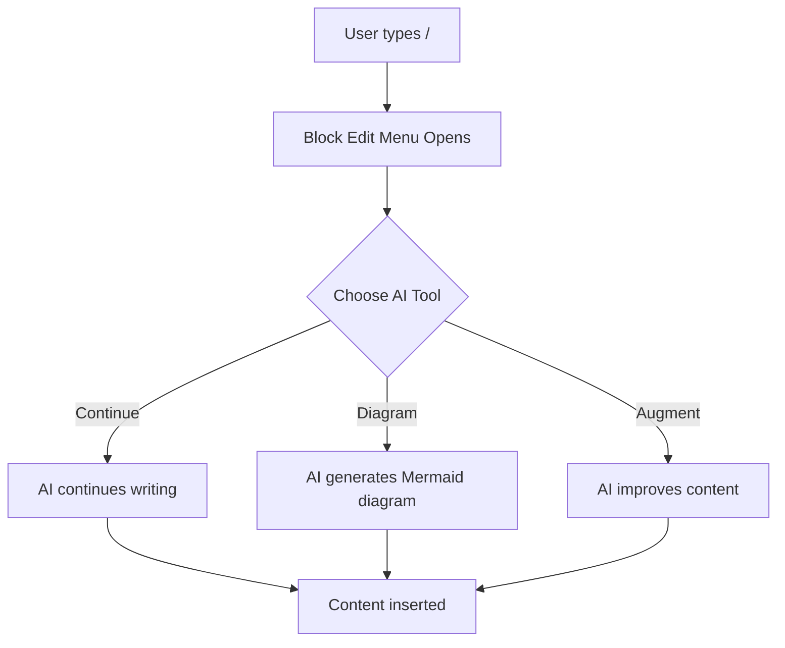

# AI-Enhanced Markdown Editor Demo

Welcome to the new Milkdown-powered markdown editor with AI integration!

## Current Features

This editor combines the power of Milkdown Crepe WYSIWYG editing with intelligent AI assistance.

### AI Commands Available

- **Continue Writing**: AI continues your text contextually
- **Generate Diagram**: Create Mermaid diagrams from descriptions  
- **Augment Document**: AI improves and enhances your content

### How to Use

1. Type `/` anywhere in the document to open the block edit menu
2. Select an AI tool from the menu
3. For testing, use the "Test:" versions that don't require API calls

## Example Content

Here's a simple list to demonstrate the editor:

- **Rich text editing** with live preview
- **Markdown output** that's compatible with any system
- **AI assistance** for content generation
- **Real-time collaboration** (coming soon)

## Mathematical Expressions

You can write LaTeX math:

$$E = mc^2$$

And inline math like $a^2 + b^2 = c^2$.

## Diagram Example

## Next Steps

Try using the AI tools:
1. Click at the end of this line and type `/` 
2. Select "Test: Continue" to see AI continuation in action
3. Try "Test: Diagram" with description "user workflow"
4. Use "Test: Augment" with instruction "add more examples"

The test versions work without API calls, so you can see the functionality immediately!
